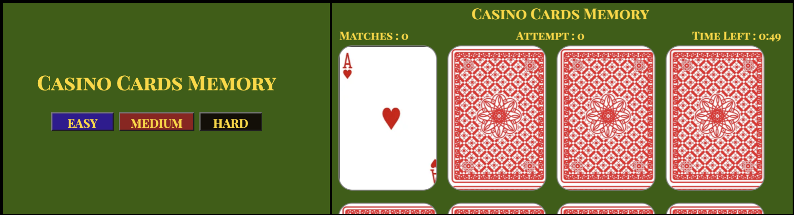

# Casino Cards Memory
## Project Description :
Casino Cards Memory is a web-based gaming application. It is a simple and enjoyable game that helps users improve their mental focus and memory.
## Project Planning Material : https://docs.google.com/document/d/1G3ZdeN6ta1ZE4QIWSNcSnt0aTk88ihRb161eAQq98ho/edit
## Installation : [Casino Cards Memory](https://matching-card-memory-games.netlify.app)

## Resources:
  - Google Chrome
  - W3Schools
  - MDN Web Docs
  - Google fonts

## Technologies :
  - HTML
  - CSS
  - JavaScript
## Tools and Services :
  - Git
  - GitHub
  - VS Code

## Usage :
- Just click on the provided hyperlink in the installation field.
- Your web browser will open the Casino Cards Memory Game.
- To choose the desired difficulty level, click on the buttons labeled "Easy," "Medium," or "Hard."
- The cards will be displayed in a random order based on the level you selected, and the timer will start.
- Additionally, you will find the "Matches" and "Attempts" fields with an initial value of 0.
- You can flip any two cards by clicking on them.
    - If the cards match, they will be turned face-up, and the "Matches" and "Attempts" values will increase.
    - If they don't match, the cards will be turned face down again, and the "Attempts" value will increase.
- The goal is to match all the pairs within the specified time limit.
- If the timer runs out, the game will end.
- To start a new game, simply click the reset button. Don't forget to select a new difficulty level.

## Next Steps:
- Add the scores as well as the number of mismatches.
- Add some CSS styling in the game