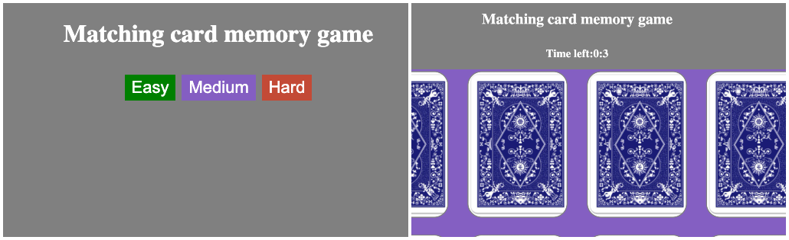

# Matching Card Memory Game
## Project Description :
  Matching card memory game is a web-based gaming application.It helps improve user concentration while they try to pair the cards.

## Installation :
    [Matching Card Memory Game](https://matching-card-memory-games.netlify.app/)

## Technologies :
    1.HTML
    2.CSS
    3.JavaScript

## Usage :

