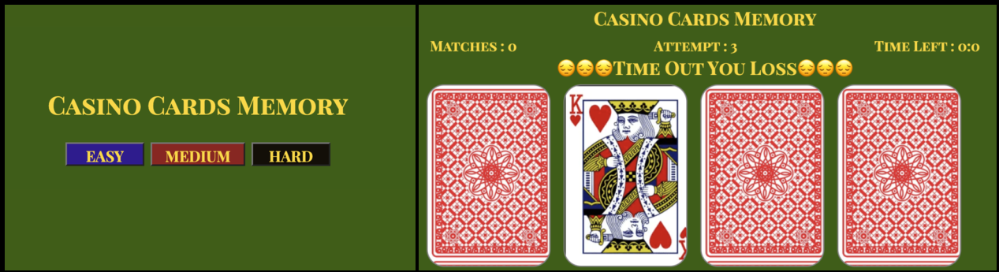

# Casino Cards Memory
## Project Description :
Casino Cards Memory game is a web-based gaming application.It is a simple, enjoyable game which helps users to improve their mental focus and memory.
## Project Planning Material : https://docs.google.com/document/d/1G3ZdeN6ta1ZE4QIWSNcSnt0aTk88ihRb161eAQq98ho/edit
## Installation : [Casino Cards Memory](https://matching-card-memory-games.netlify.app)

## Resources:
  - Google Chrome
  - W3Schools
  - MDN Web Docs
  - Google fonts

## Technologies :
  - HTML
  - CSS
  - JavaScript
## Tools and Services :
  - Git
  - GitHub
  - VS Code

## Usage :
- Click the link in the installation field
- Casino Cards Memory Game will launch in your browser
- Click the buttons to select the level "Easy," "Medium," or "Hard."
- The cards will be displayed in a shuffled order based on the level, and the timer will be displayed and begin.
- The user can randomly click on the two cards to flip them.
     - If they match, they will be face up.
     - If they do not match, they will be turned face down.
- The user will try to match all of the pairs within the time limit.
- If the timer runs out, the game will come to an end.
- The user needs to click the reset button to restart the game from the beginning. And, once again, the user needs to select a level.

## Next Steps:
- Add the scores as well as the number of mismatches.
- Add some CSS styling in the game